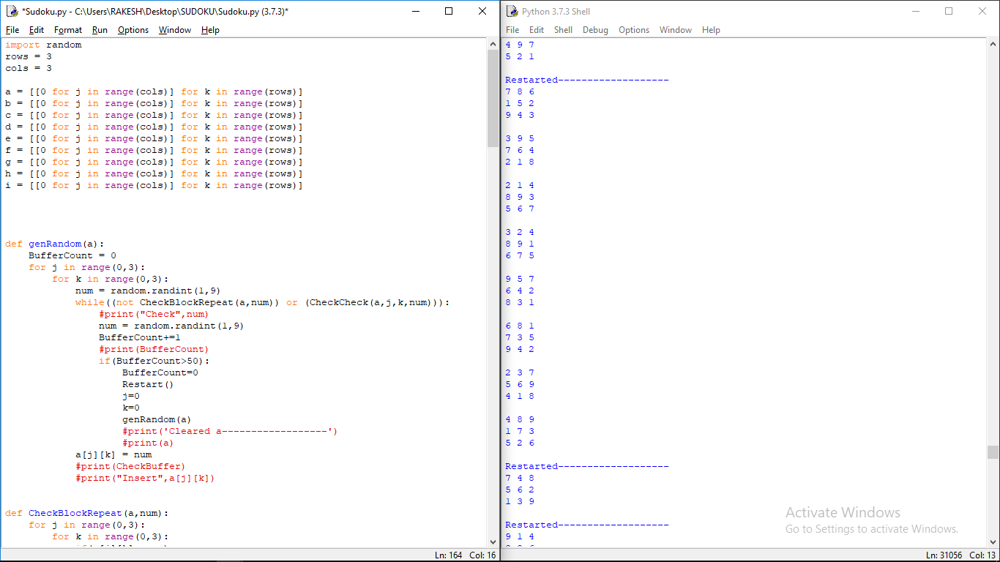

# Sudoku-Matrix-Generator
Program to generate 3x3 matrices with 3x3 elements as per the rules of SUDOKU

Please check the code as it requires more recursions.
it may take up more resources.

Try to optimise the code before trying it.Thank you

I only got 8 matrices maximum as output but it require 9 matrices to complete the puzzle.

